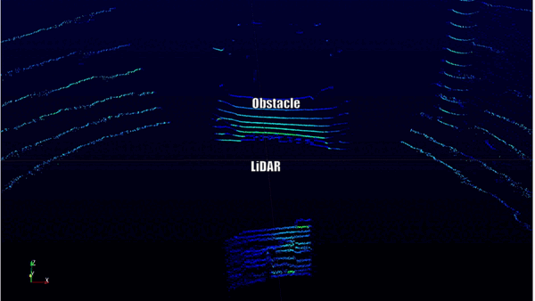
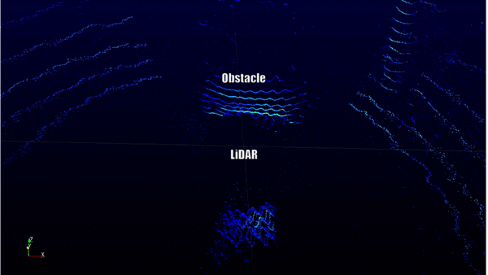

# 電気通信大学 菅原研究室

電気通信大学・菅原研究室では，ソフトウェアとハードウェアの境界面にあるセキュリティ上の問題を研究しています．[﨑山・宮原研究室](http://sakiyama-lab.jp/)，[李研究室](http://www.uec-li-lab.com)，および [岩本・渡邉研究室](https://iw-lab.jp)と協力をしています．大学院入学を希望される学外生は[こちら](https://www.uec.ac.jp/admission/open-graduate/tour.html)から申し込むか，メールでご連絡ください．

# News

- 2025/05/19: D1 の平賀君が大阪大学・神戸大学と共同で行った研究が，半導体・集積回路に関するトップカンファレンス VLSI Symposium 2025 に採録されました．

- 2025/05/06: M2 の大西君がフロリダ大学と共同で行った研究成果が，セキュリティのトップカンファレンス USENIX Security 2025 に採録されました．ラップトップなどに搭載されたディジタルマイクが意図せず発するノイズを，アンテナを用いて受信・復調すると，元の音声を復元できる新たな現象を発見しました．この脆弱性は，隣室から通話を盗聴する脅威を生じる可能性があります．
<iframe src="https://drive.google.com/file/d/1ZIJ2xxa8j1NE1CYjHz3NU20yzAxWbXH4/preview" width="640" height="480" allow="autoplay"></iframe>
	   
- 2024/10/18: 3月に卒業した土井君が在学中に行った研究が，Attacks and Solutions in Hardware Security (ASHES 2024) に採録されました．自己混合干渉と呼ばれる光学的なテクニックを用いて構築したレーザーマイク（レーザーを照射した位置の振動を計測する装置）が，遠隔から盗聴を引き起こす脅威を明らかにしました．
- 2024/06/21: 3月に卒業した田中君が在学中に行なった研究が IEEE Access に採録されました [Web](https://ieeexplore.ieee.org/document/10555221)．
遠隔からレーザーを照射することで，光学式の入力デバイスを遠隔操作できる脆弱性を発見しました．以下は，投影式キーボードに任意のコマンドを挿入したり，折り曲げ式マウスのカーソルを操作したりするデモ動画です．
<iframe src="https://drive.google.com/file/d/1qT3HVpCjtLuj6ZrIHpCZtG2D2v7BU-QV/preview" width="640" height="480" allow="autoplay"></iframe>

- 2024/05/26: 三菱電機・NTT と共同で行った研究成果を, Eurocrypt で発表しました [PDF](https://link.springer.com/chapter/10.1007/978-3-031-58716-0_4).

- 2024/05/20: フロリダ大学と共同で行った研究成果を, セキュリティのトップカンファレンス IEEE Security & Privacy 2024 で発表しました [PDF](https://www.computer.org/csdl/proceedings-article/sp/2024/313000a245/1WPcZ3IOXJu),
[プロジェクトの Web ページ](https://cpseclab.github.io/aquasonic/). 海底データセンターに対して水中から音波を照射することでハードディスクドライブを揺らし，データセンターにおけるデータアクセスを妨害する脆弱性に関するものです．
報道: [フロリダ大学](https://news.ufl.edu/2024/05/underwater-data-center-security/),
[Techspot](https://www.techspot.com/news/103061-acoustic-attacks-could-serious-threat-future-underwater-data.html),
[NewScientist](https://www.newscientist.com/article/2430616-underwater-data-centres-could-be-destroyed-by-loud-noises/), 
[The Register](https://www.theregister.com/2024/05/17/underwater_datacenters_sound_waves/),
[Computing](https://www.computing.co.uk/news/4209265/underwater-datacentres-vulnerable-sonic-attacks).

<video width="500px" height="400px" controls="controls">
    <source src="https://cpseclab.github.io/aquasonic/video/Demo.mp4" type="video/mp4" />
</video>
	   
- 2024/05/06: 三菱電機・NTT と共同で行った研究成果を, RSA Conference の Cryptographers' Track で発表しました [PDF](https://link.springer.com/chapter/10.1007/978-3-031-58868-6_5).

- 2024/03/29: 三菱電機・NTT と共同で行った研究成果を, 30th Fast Software Encryption Conference (FSE 2024) で発表しました [PDF](https://tosc.iacr.org/index.php/ToSC/article/view/11295)．

- 2024/03/08: 三菱電機・NTT と共同で行った研究成果を, 22nd International Conference on Applied Cryptography and Network Security (ACNS 2024) で発表しました [論文](https://dl.acm.org/doi/abs/10.1007/978-3-031-54770-6_13)．

- 2024/03/01: 米カリフォルニア大学アーバイン校、米フロリダ大学、米 Toyota InfoTech Labs と共同で行った研究成果を，The Network and Distributed System Security (NDSS) Symposium で発表しました．不可視のレーザーを照射することで，自動運転の道路標識を妨害できる脆弱性を発見しました．これは，1月に ITMedia の記事になった成果です．

- 2024/02/26: 車のセキュリティに関する国際会議 VehicleSec 2024 において，3件の発表を行いました (レーザー照射により交通信号機の識別を妨害できる脆弱性の発見, レーザーにより LiDAR 自己位置推定を騙せる脆弱性の発見, 車載ネットワークセキュリティのハンズオン学習プラットフォーム)．Outstanding Reviewer Award および DENSO Best Demo Award Runner-up を受賞しました．

- 2024/01/25: 米カリフォルニア大学アーバイン校、米フロリダ大学、米 Toyota InfoTech Labs と共同で行った研究成果が ITmedia で紹介されました:
[道路標識に「人に見えないレーザー」照射　自動運転車を欺く攻撃　米国と日本の研究者らが発表](https://www.itmedia.co.jp/news/articles/2401/25/news049.html).
[プロジェクトの Web ページ](https://sites.google.com/view/cav-sec/ilr-attack), [論文](https://arxiv.org/abs/2401.03582).

- M1 の平賀君が三菱電機・NTT と共同で行った研究成果を, The Information Security Conference (ISC 2023) で発表しました．

- M1 の平賀君が三菱電機・NTT と共同で行った研究成果をコンピュータセキュリティシンポジウム2023（CSS2023）において発表し，CSS 奨励賞を受賞しました. [大学の広報](https://www.uec.ac.jp/news/prize/2023/20231107_5756.html).

- 2023/09/11: 三菱電機・NTT と共同で行った研究成果を，暗号実装における国際会議 CHES 2023 で発表しました．
マスキング（サイドチャネル攻撃対策）を効率的に行うことができる新たな暗号利用モード MMM を提案しました．
[論文](https://tches.iacr.org/index.php/TCHES/article/view/11159). 

- 2023/08/10: ミシガン大学，フロリダ大学と共同で行った研究成果を，セキュリティのトップカンファレンス USENIX Security 2023 で発表しました．
自動運転で使われる LiDAR (3次元計測センサ) に対して偽の反射光を照射することで，センサの視界から特定のものを削除することができる脆弱性を発見しました．
昨年，ITmedia で記事になったものです([自動運転車の視界から“人だけ”を消す攻撃 偽情報をLiDARに注入 電通大などが発表](https://www.itmedia.co.jp/news/articles/2211/07/news043.html)). 
[プロジェクトの Web ページ](https://cpseclab.github.io/youcantseeme/), [論文](https://www.usenix.org/system/files/usenixsecurity23-cao.pdf).

<video  width="390" height="260" controls="controls" src="https://cpseclab.github.io/youcantseeme/vid/OutdoorLidarForward.mp4" type="video/mp4"></video>

- 2023/05/30: フロリダ大学と共同で行なった研究成果を，無線セキュリティに関する国際会議 WiSec 2023 で発表しました．自動運転で使われる LiDAR (3次元計測センサ) に対して電磁波を照射することで偽情報を挿入し，物体検出などの続く処理における誤検出・誤識別を引き起こす脆弱性を発見しました．
[プロジェクトの Web ページ](https://cpseclab.github.io/EMILidar/), [論文](https://dl.acm.org/doi/abs/10.1145/3558482.3590192), [発表動画](https://youtu.be/AfwCUC1EU-o?feature=shared).
{:width="400px"}
{:width="400px"}

- 2023/02/27: カリフォルニア大学アーバイン校, フロリダ大学, Toyota InfoTech Labs と共同で行なった研究成果を，車セキュリティに関する国際会議 VehicleSec 2023 で発表し, ETAS Best Short/WIP Paper Award と Qualcomm Best Demo Award を受賞しました ([電通大 Web ページ](https://www.uec.ac.jp/news/prize/2023/20230301_5199.html), [トヨタによる発表](https://amrd.toyota.com/itl-researcher-received-the-best-paper-paper-award-at-the-vehiclesec-2023-workshop/))．

- 2023/02/27: ミシガン大学，ノースイースタン大学と共同で行なった人工衛星のセンサセキュリティに関する研究成果を，宇宙セキュリティに関する国際会議 SpaceSec 2023 で発表しました．

- 2022/11/10: 三菱電機・NTT と共同で行った研究成果を，セキュリティのトップカンファレンス [ACM CCS 2022](https://www.sigsac.org/ccs/CCS2022/) で発表しました（[NTT による広報発表](https://group.ntt/jp/topics/2022/11/07/acm_ccs_2022_paper_acceptance.html)）．

- 2022/11/07: M1 の土井君が，シリコンキャパシタから生じる音響リークに関する研究成果を，セキュリティのトップカンファレンス [ACM CCS 2022](https://www.sigsac.org/ccs/CCS2022/) でポスター発表しました．

- 2022/11/07: ミシガン大学，フロリダ大学と共同で行った研究成果が ITmedia で紹介されました: 
[自動運転車の視界から“人だけ”を消す攻撃 偽情報をLiDARに注入 電通大などが発表](https://www.itmedia.co.jp/news/articles/2211/07/news043.html). 
[プロジェクトの Web ページ](https://cpseclab.github.io/youcantseeme/), [論文](https://arxiv.org/abs/2210.09482).

- 2022/10/31: M1 の田中君が，レーザー照射による圧力センサへの攻撃に関する研究成果を，国際会議 [IEEE Sensors 2022](https://2022.ieee-sensorsconference.org) で発表しました．

- 2022/10/25: M1 の根本君，M2 の山下君が [HWS 研究会](https://ken.ieice.org/ken/program/index.php?tgs_regid=fe7ebc7938709eddf62572fb3076b44b3a0564a28a5c692e8053d2016d4aae2c&tgid=IEICE-HWS)で発表を行いました．

- 2022/10/22: M1 の田中君，土井君，根本君が，トヨタ自動車・Toyota Motor North America, Inc.・Toyota Tsusho Systems US, Inc.
が開催した CTF イベント Hack Festa 2022 に参加しました（[トヨタ自動車による広報発表](https://www.toyota-tokyo.tech/news/pdf/221107report_jp.pdf)）．

- 2022/01/21: M1 の浅野君，B4 の金君，田中君，土井君が[SCIS2022](https://www.iwsec.org/scis/2022/)で発表を行いました．

- 2021/09/17: B4 の金君，田中君，土井君が[ソサイエティ大会](http://www.ieice-taikai.jp/2021society/jpn/)で発表を行いました．

- 2021/09/17: M1 の浅野君が [PROOFS 2021](http://www.proofs-workshop.org/2021/) にて研究発表を行いました．

- 2021/01/22: [暗号と情報セキュリティシンポジウム 2021](https://www.iwsec.org/scis/2021/) が開催され，M1 の高木君，B4 の浅野君が講演を行いました．

- 2020/10/28: コンピュータセキュリティシンポジウム 2020 が開催され，菅原と，B4 の山下君が講演を行いました．

- 2020/10/20: 菅原が寄稿した暗号ハードウェアに関する解説論文が日本銀行金融研究所「金融研究」誌で公開されました: [暗号ハードウェアの研究開発動向：フィジカリー・アンクローナブル・ファンクション](https://www.imes.boj.or.jp/research/papers/japanese/kk39-4-2.pdf).

- 2020/10/13: 国際会議 IEEE 9th Global Conference on Consumer Electronics (GCCE 2020) にて，M2 の高木くんと M1 の藪さんが研究発表を行いました．

- 2020/09/17: B4 の山下君がソサイエティ大会で PUF の安全性評価に関する発表を行いました．

- 2020/09/14: Conference on Cryptographic Hardware and Embedded Systems (CHES) がオンライン開催され，菅原による発表の動画が公開されました: [Youtube](https://youtu.be/4qBQykARnZU)．

- 2020/05/17: Eurocrypt 2020 が 5月11〜15日にオンライン開催され，菅原による発表の動画が公開されました: [Youtube](https://youtube.com/watch?v=9j242OfsImc)．
<iframe width="390" height="250" src="https://www.youtube.com/embed/9j242OfsImc" frameborder="0" allow="accelerometer; autoplay; clipboard-write; encrypted-media; gyroscope; picture-in-picture" allowfullscreen></iframe>

- 2020/05/06: **講義について**: 菅原が担当する 2020 年度の「オペレーティングシステム」は遠隔講義として開講します．シラバスに記載された ID から参加してください．

- 2020/04/20: 菅原が2019年夏に国際会議 CHES2019 で発表した動画が公開されました: [Youtube](https://youtube.com/watch?v=Qm8MAauS0Rc)．

- 2020/3/25: 電気通信大学の[卒業式]()が行われました。薮さん(B4)が目黒会賞、藤さん(M1)が学生表彰されました。

- 2020/01/31: 高木くん，藤さん(M1)，薮さん(B4)が，[SCIS2020](https://www.iwsec.org/scis/2020/)で[発表]()しました

- 2019/12/27: 技術系 Youtube チャネル Smarter Every Day で Light Commands が紹介されました．
<iframe width="390" height="220" src="https://www.youtube.com/embed/ozIKwGt38LQ" title="YouTube video player" frameborder="0" allow="accelerometer; autoplay; clipboard-write; encrypted-media; gyroscope; picture-in-picture" allowfullscreen></iframe>

- 2019/11/15: [研究室説明会・OPEN CAMPUS 2019@調布祭]()について

- 2019/11/04: レーザーを用いて音声コマンドを挿入する攻撃 [Light Commands](https://lightcommands.com/index_jp.html) を公開しました.
    - 報道(国内): [Gigazine](https://gigazine.net/news/20191105-shining-lasers-hack-voice-assistants/), [ITMedia](https://www.itmedia.co.jp/news/articles/1911/05/news058.html), [Engadget](https://japanese.engadget.com/2019/11/04/iphone/), [Gizmodo](https://www.gizmodo.jp/2019/11/light-command-scary.html), [CNET](https://japan.cnet.com/article/35144955/), [Business Insider](https://www.businessinsider.jp/post-201928)
    - 報道(海外): [Wired](https://www.wired.com/story/lasers-hack-amazon-echo-google-home/),
[Ars Technica](https://arstechnica.com/information-technology/2019/11/researchers-hack-siri-alexa-and-google-home-by-shining-lasers-at-them/),
[New York Times](https://www.nytimes.com/2019/11/04/technology/digital-assistant-laser-hack.html),
[CNN](https://edition.cnn.com/2019/11/04/tech/alexa-siri-laser-attack-research/index.html),
[Washington Post](https://www.washingtonpost.com/business/2019/11/05/hackers-can-hijack-your-iphone-or-smart-speaker-with-simple-laser-pointer-even-outside-your-home/)

<iframe width="390" height="250" src="https://www.youtube.com/embed/ORji7Tz5GiI?rel=0&cc_load_policy=1" frameborder="0" allow="accelerometer; autoplay; encrypted-media; gyroscope; picture-in-picture" allowfullscreen></iframe>
<iframe width="390" height="250" src="https://www.youtube.com/embed/ihRAwc24nXw" frameborder="0" allow="accelerometer; autoplay; encrypted-media; gyroscope; picture-in-picture" allowfullscreen></iframe>
<iframe width="390" height="250" src="https://www.youtube.com/embed/iK2PtdQs77c" frameborder="0" allow="accelerometer; autoplay; encrypted-media; gyroscope; picture-in-picture" allowfullscreen></iframe>
<iframe width="390" height="250" src="https://www.youtube.com/embed/EtzP-mCwNAs" frameborder="0" allow="accelerometer; autoplay; encrypted-media; gyroscope; picture-in-picture" allowfullscreen></iframe>

- 2019/10/28: 今年度の[配属スケジュール](https://www.sugawara-lab.jp/haizoku.html)を更新しました

- 2019/09/14: 小沼くん，土屋さん，薮さん(B4)が，[ソサイエティ大会 2019](https://www.ieice-taikai.jp/2019society/jpn/index.html)で[発表]()しました

- 2019/07/24: [たこやきパーティー]()をしました！

- 2019/07/11: [OPEN_CAMPUS_2019]()について

- 2019/06/30: [合宿]()をしました！

- 2019/06/01: [2019年度大学院オープンラボ]()を行いました！

- 2019/05/31: [2019年度大学院オープンラボについて]()

- 2019/04/01: 2019年度 菅原研究室が[始動]()しました。

- 2019/03/25: 電気通信大学の[学部生卒業式]()が行われました。藤さん(B4)が目黒会賞受賞、辰巳さん(M1)が学生表彰されました。

- 2019/03/07~08: 藤さん(B4)が，[SEC道後2019](http://www.sec-dogo.jp/)で発表し，学生研究賞を[受賞]()しました

- 2019/01/22~25: 高木くん，藤さん(B4)が，[SCIS2019](https://www.iwsec.org/scis/2019/)で[発表]()しました

- 2018/12/08: 新しい Web ページを作成しました
