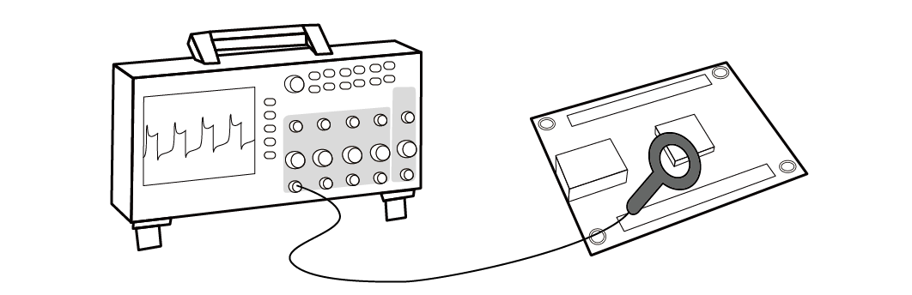

# 研究室概要

情報技術を現実世界にある機器や装置を連携させる技術が，次の10年間で大きく発展すると期待されています．たとえば，車の自動運転や工場の自動操業ができるようになれば，社会に大きな恩恵があります．しかし，それは同時に，情報セキュリティ技術で守らなくてはいけない範囲が大きく広がることを意味します．特に，物理世界と関わることから，ハードウェアやアナログ領域での新しい脅威が出現します．新しい脅威に対しては，どのような攻撃がありうるのか，どのような対策法がありうるのかを先回りして研究することで，将来に備える必要があります．菅原研究室は，そのような，ソフトウェアとハードウェアの境界面にあるセキュリティ上の問題を研究しています． 

---

## センサへの攻撃

情報システムを実世界の機器に接続することで，自動車・ロボット・工場などを自動化する技術が期待されています．システムの末端にはセンサが付いており，アナログの世界とディジタルの世界をつないでいます．それに対し，アナログ領域で誤情報を挿入するセンサなりすまし攻撃の脅威が指摘されています．たとえば，センサにレーザーや音波を照射することで，センサが計測する距離や傾きを騙す攻撃が知られている．これらの攻撃は，情報がディジタル化される前のアナログ領域で行われるため，従来の暗号技術や情報セキュリティ技術では防ぐことができません．本研究室では，センサなりすまし攻撃が可能になる物理的メカニズムや，信号処理に基づく対策法について研究を行っています．

{:width="800px"}

研究の一例として，レーザー照射によりスマートスピーカーに無音でコマンドを挿入する攻撃である Light Commands があります．

<iframe width="390" height="250" src="https://www.youtube.com/embed/ORji7Tz5GiI?rel=0&cc_load_policy=1" frameborder="0" allow="accelerometer; autoplay; encrypted-media; gyroscope; picture-in-picture" allowfullscreen></iframe>
<iframe width="390" height="250" src="https://www.youtube.com/embed/ihRAwc24nXw" frameborder="0" allow="accelerometer; autoplay; encrypted-media; gyroscope; picture-in-picture" allowfullscreen></iframe>
<iframe width="390" height="250" src="https://www.youtube.com/embed/iK2PtdQs77c" frameborder="0" allow="accelerometer; autoplay; encrypted-media; gyroscope; picture-in-picture" allowfullscreen></iframe>
<iframe width="390" height="250" src="https://www.youtube.com/embed/EtzP-mCwNAs" frameborder="0" allow="accelerometer; autoplay; encrypted-media; gyroscope; picture-in-picture" allowfullscreen></iframe>

その他にも，[自動運転の測距センサ](https://arxiv.org/abs/2210.09482) , 
[心電センサ](https://arxiv.org/abs/2108.08972), および
[医療用温度センサ](https://meridian.allenpress.com/bit/article/55/3/112/469795/)
などのセキュリティを研究してきました．

## サイドチャネル攻撃

暗号を実装した機器の中には，機器の所有者が攻撃者となる環境（敵性の利用環境）で利用されるものがあります．例えば IC カードの所有者は，自身の所有するカードを攻撃して，残額などを増やそうとする動機があります．そのような環境で利用される機器は，機器への物理的なアクセスを伴う強力な攻撃に耐える必要があります．サイドチャネル攻撃とは，そのような環境で利用される攻撃法の中で最も強力なものの１つです．この攻撃は，暗号を実装したチップから生じる消費電力や電磁波の変化として生じる微小な情報漏えいを用いて暗号解読を行います．本研究室では，サイドチャネル攻撃の安全性評価や対策に関する研究を行っています．

{:width="700px"}

[back](./)
