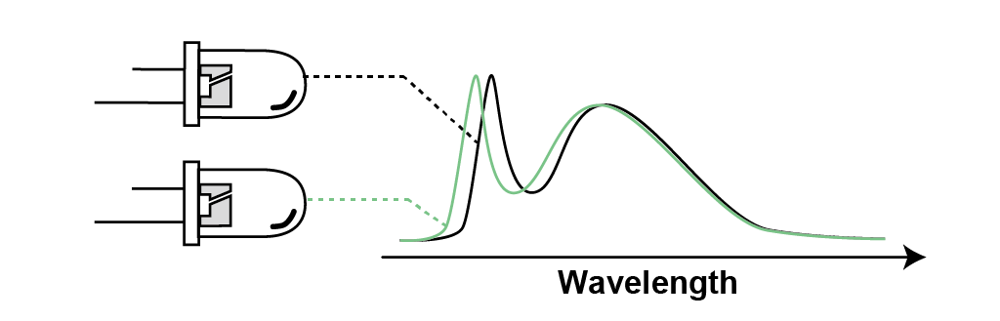

# 研究室概要

情報技術を現実世界にある機器や装置を連携させる技術が，次の10年間で大きく発展すると期待されています．たとえば，車の自動運転や工場の自動操業ができるようになれば，社会に大きな恩恵があります．しかし，それは同時に，情報セキュリティ技術で守らなくてはいけない範囲が大きく広がることを意味します．特に，物理世界と関わることから，ハードウェアやアナログ領域での新しい脅威が出現します．新しい脅威に対しては，どのような攻撃がありうるのか，どのような対策法がありうるのかを先回りして研究することで，将来に備える必要があります．菅原研究室は，そのような，ソフトウェアとハードウェアの境界面にあるセキュリティ上の問題を研究しています． 

---

## サイドチャネル攻撃

暗号を実装した機器の中には，機器の所有者が攻撃者となる環境（敵性の利用環境）で利用されるものがあります．例えば IC カードの所有者は，自身の所有するカードを攻撃して，残額などを増やそうとする動機があります．そのような環境で利用される機器は，機器への物理的なアクセスを伴う強力な攻撃に耐える必要があります．サイドチャネル攻撃とは，そのような環境で利用される攻撃法の中で最も強力なものの１つです．この攻撃は，暗号を実装したチップから生じる消費電力や電磁波の変化として生じる微小な情報漏えいを用いて暗号解読を行います．本研究室では，サイドチャネル攻撃の安全性評価や対策に関する研究を行っています．

{:width="700px"}

## センサへの攻撃

情報システムを実世界の機器に接続することで，自動車・ロボット・工場などを自動化する技術が期待されています．システムの末端にはセンサが付いており，アナログの世界とディジタルの世界をつないでいます．それに対し，アナログ領域で誤情報を挿入するセンサなりすまし攻撃の脅威が指摘されています．たとえば，センサにレーザーや音波を照射することで，センサが計測する距離や傾きを騙す攻撃が知られている．これらの攻撃は，情報がディジタル化される前のアナログ領域で行われるため，従来の暗号技術や情報セキュリティ技術では防ぐことができません．本研究室では，センサなりすまし攻撃が可能になる物理的メカニズムや，信号処理に基づく対策法について研究を行っています．

{:width="800px"}

## Row Hammer

組込機器だけではなく，サーバのような大規模な計算システムにおいても，ハードウェア由来のセキュリティ上の脅威が問題になりつつあります．Row Hammer は，そのような攻撃の1つです．計算機のメモリの中には，ノイズ耐性の低いものが存在することが分かっています．そのようなメモリに対して，特定パターンで集中的なメモリアクセスをかけると，アクセスしていない箇所のメモリの値が化ける現象が知られています．そのようなメモリ化けは，深刻なセキュリティ上の問題につながりうるものです．本研究室では，問題のあるメモリかどうかを識別するためのテスト法などの研究を行っています．

{:width="800px"}

## 暗号の実装

本研究室では，様々なプラットフォームにおける効率的な暗号実装を研究しています．１つの例は，計算リソースに乏しい組込機器です．最近では，電球のようなものにまで，通信機能と暗号が搭載されるようになっています．そのような環境で暗号を使うには，効率的な実装技術が必要です．もう１つの例は高機能計算です．特に最近では，プログラム可能な回路が搭載されたアクセラレータが，サーバなどに搭載されるようになってきています．そのような環境で効率的に暗号を実装するには，さらにまた別の技術が必要となります．

{:width="800px"}

## 人工物メトリクス

工業製品は，個々の差が無くなるように品質管理がされています．しかし，よく見ると，小さな個体差を持っています．そのような個体差を見分けるための技術を人工物メトリクスと言います．個体を見分ける技術は，模倣品の排除や，通信相手の認証などに応用できます．本研究室では，現在は特に，分光器を用いて発光ダイオードの個体差を見分ける技術を研究しています．

{:width="800px"}

[back](./)
