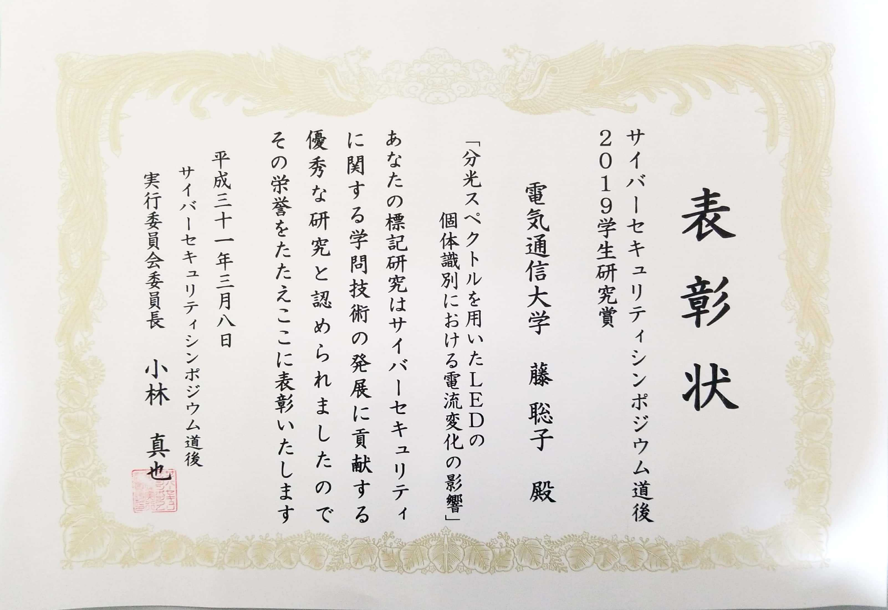

# 藤聡子さん(総合情報学科)がSEC道後2019学生研究賞を受賞

菅原研究室の藤聡子さん（総合情報学科4年）が，サイバーセキュリティシンポジウム道後2019（SEC道後2019）において学生研究賞を受賞しました．

この賞は，サイバーセキュリティ分野における技術開発や暗号等の情報セキュリティ基礎理論に関する研究発表を行った学生の中から，独創的な着想や将来への有用性，期待度を考慮に4人の学生に対して贈られたものです．藤さんが，2019年1月24日に大津市で開催された暗号と情報セキュリティシンポジウム（SCIS2019）で発表した論文「 分光スペクトルを用いたLEDの個体識別における電流変化の影響」が高く評価され，本受賞に至りました．

【著者】
藤聡子(総合情報学科4年)，李陽・崎山一男・菅原健(情報学専攻)

【題目】
分光スペクトルを用いたLEDの個体識別に向けた電流変化の影響

## 表彰状

{:width="300px"}

## 道後の街並み

{:width="300px"}

道後温泉の街並み，素敵でした． by 藤

[back](./)
