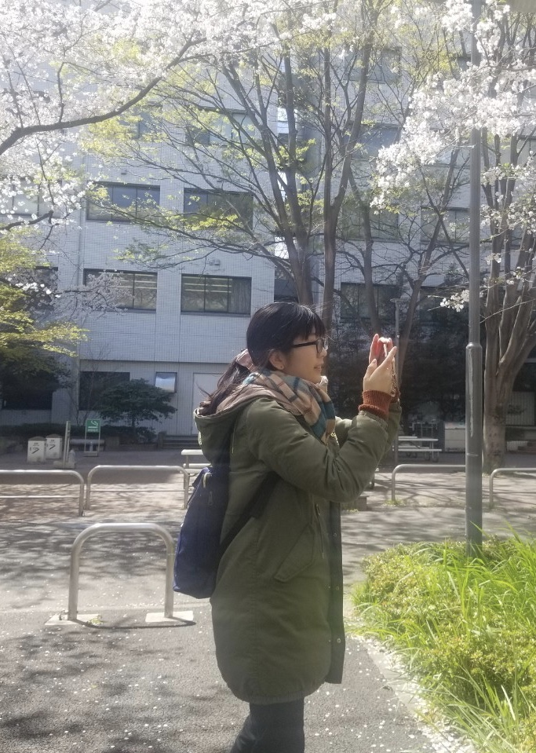

# 辰巳 恵里奈

{:width="300px"}

Erina Tatsumi

学年 ：修士2年

email：e.tatsumi  後ろに”@uec.ac.jp”を付けてください

---

## 研究テーマ
Row Hammer

## Biography
- 2014/04, 電気通信大学　情報理工学部　総合情報学科　入学
- 2018/03, 電気通信大学　情報理工学部　総合情報学科　卒業
- 2018/04, 電気通信大学大学院　情報理工学研究科　情報学専攻　入学

## 受賞歴

- 平成29年度電気通信大学目黒会賞
- IWSEC2018 Best Poster Award

## List of Publications

### 学会口頭発表(査読なし)

- 辰巳恵里奈, 菅原健，崎山一男, “デバイスドライバを用いたRow Hammerのテストツール,” 2018年暗号と情報セキュリティシンポジウム (SCIS2018), 3D3-2, 5 pages, (Jan., 2018).

### その他

- 辰巳恵里奈, 菅原 健, 崎山一男, “Row Hammerに関する基礎実験,” ハードウェアセキュリティ研究会 (HWS), (Jun., 2017).
- 辰巳恵里奈, 菅原健, 崎山一男, “Raw Hammerの見える化,” コンピュータセキュリティシンポジウム2017(CSS2017)デモンストレーション（ポスター）セッション, (Oct., 2017).
- Erina Tatsumi, Kazuo Sakiyama, and Takeshi Sugawara, “A Case Study of Row Hammer under Different Refresh Rates” Poster Session, IWSEC2018, (Aug., 2018).

[back](./)
